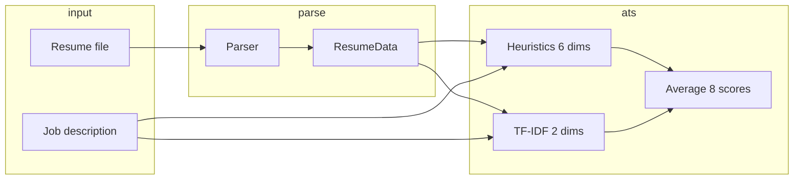

# Algorithm Overview

Brief technical reference for how Resume Intelligence scores and analyzes resumes.  
Implementation: `resume_intelligence/backend/ats.py`, `tfidf_scorer.py`, `matcher.py`.

---

## Pipeline

```
Upload (PDF/DOCX)
    → Parser (PyMuPDF / pdfplumber / python-docx)
    → ResumeData (structured fields + raw_text)
    → ATS engine (8 dimensions + TF-IDF)
    → Skill gap / LLM features (optional)
```

No training step — scoring is **rule-based heuristics + scikit-learn TF-IDF** at runtime.

---

## ATS score (0–100)

**Final score** = average of 8 dimension scores (12.5% weight each).

```text
ats_score = (d1 + d2 + ... + d8) / 8
```

Each dimension returns 0–100 before averaging.

| # | Dimension | Method | Notes |
|---|-----------|--------|-------|
| 1 | Impact language | Lexicon overlap on experience/project bullets | 18 impact words (e.g. *achieved*, *optimized*); ~4 hits → 100 |
| 2 | Quantification | Regex on bullets | `%`, `$`, counts, time units, `Nx`; capped at 100 |
| 3 | ATS keyword alignment | TF-IDF terms from JD vs resume text | Top JD keywords; score = % found in resume |
| 4 | Section completeness | Binary checks | name, email, skills, experience, education, projects |
| 5 | Action verb density | Verb frequency in bullets | 20 action verbs; density × 2000, capped at 100 |
| 6 | Skill relevance | Set overlap | JD skills ∩ resume skills / JD skills |
| 7 | Formatting | Heuristic checklist | contact, ≥3 skills, length ≥200 chars, has experience/projects |
| 8 | Role-fit | TF-IDF cosine similarity | Full resume text vs full JD (1-grams + 2-grams) |

### TF-IDF settings

Used in `tfidf_scorer.py`:

- **Vectorizer:** `TfidfVectorizer(stop_words="english", ngram_range=(1, 2))`
- **Keyword extraction:** `max_features=500`, top 25 terms from JD
- **Document similarity (role-fit):** `max_features=3000`, cosine similarity ∈ [0, 1] → ×100

References: [scikit-learn TfidfVectorizer](https://scikit-learn.org/stable/modules/generated/sklearn.feature_extraction.text.TfidfVectorizer.html)

### Skill gap

`matcher.py` extracts skills from JD and resume (keyword lists + normalization), then reports matched / missing and `match_percent` (feeds dimension 6).

---

## What we do *not* claim

- No labeled hiring dataset → no published accuracy / F1 on real ATS outcomes
- Embeddings module exists for warmup but **ATS does not use sentence-transformer cosine** for the 8-dimension score
- Parser quality strongly affects downstream scores (garbage in → garbage out)

See [DATA_AND_EVALUATION.md](DATA_AND_EVALUATION.md) for honest metrics.

---

## LLM-powered features (separate from ATS math)

| Feature | Input | Provider |
|---------|-------|----------|
| Form autofill | Resume + question list | Groq or Gemini via `LLM_PROVIDER` |
| Resume improvement | Parsed bullets | Same |
| Candidate summary | Resume + optional JD | Same |
| Project analyzer | GitHub README (+ URL) | Same + GitHub API |

LLM outputs are **not** blended into the numeric ATS formula. They are advisory / generative layers on top.

---

## Known limitations & roadmap

| Limitation | Tracking |
|------------|----------|
| Equal 12.5% weights may not fit all roles | [#22](https://github.com/PranjalManhgaye/Resume_checker/issues/22) |
| No company/industry profiles | [#14](https://github.com/PranjalManhgaye/Resume_checker/issues/14) |
| Missing skills not ranked by JD importance | [#19](https://github.com/PranjalManhgaye/Resume_checker/issues/19) |
| Fancy PDF layouts parse poorly | [#3](https://github.com/PranjalManhgaye/Resume_checker/issues/3) |

---

## Quick diagram


